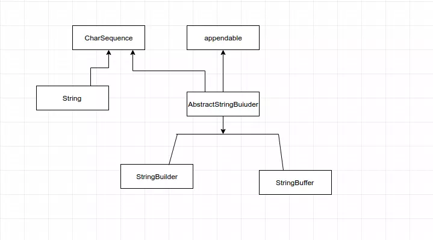

String, StringBuffer và StringBuilder
-
Khi làm việc với dữ liệu kiểu text trong Java cung cấp 3 class String, StringBuffer và StringBuilder.

 + String là không thể thay đổi (immutable), và không cho phép có class con.
 + StringBuffer, StringBuilder có thể thay đổi (mutable). StringBuilder và StringBuffer là giống nhau, nó chỉ khác biệt tình huống sử dụng có liên quan tới đa luồng (Multi Thread). => về tốc độ xử lý StringBuilder là tốt nhất, sau đó StringBuffer và cuối cùng mới là String.

| StringBuilder      | StringBuffer    |
|--------------------|-----------------|
| Không synchronized | Có synchronized |
| Fail Safe          | Fail Fast       |

- Giống nhau: Cả 2 đều lưu trữ giá trị trong vùng nhớ Heap. Đều có thể thay đổi được giá trị

    Heap là 1 cấu trúc lưu trữ dữ liệu trên Ram được sử dụng khi chương trình run-time. Heap cung cấp vùng nhớ cho các yêu cầu cấp phát động.
- Synchronized là cơ chế khóa hoặc đồng bộ dữ liệu, tránh việc mất mát dữ liệu khi có nhiều thread cùng sử dụng 1 dữ liệu chung.