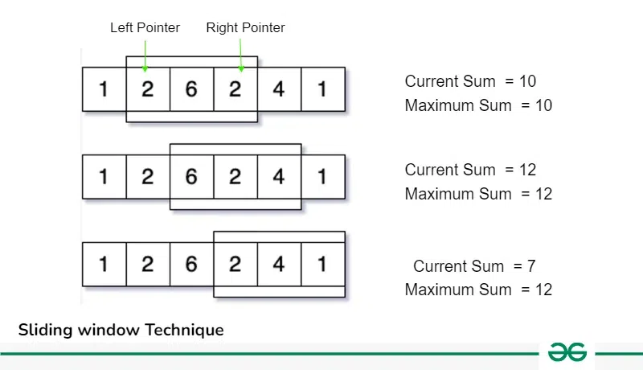

**SLIDING WINDOW TECHNIQUE**

_I.What is Sliding Window Technique?_

Sliding Window problems are problems in which a fixed or variable-size window is moved through a data structure, typically an array or string, to solve problems efficiently based on continuous subsets of elements. This technique is used when we need to find subarrays or substrings according to a given set of conditions.

Let’s take an example to understand this properly, say we have an array of size N and also an integer K. Now, we have to calculate the maximum sum of a subarray having size exactly K.

Approach: take one K size subarray from 0 to K-1 index and calculate its sum now shift our range one by one along with the iterations and update the result, like in next iteration increase the left and right pointer and update the previous sum as shown in the below image.

_II. Identify Sliding Window Problems:_

- These problems require Finding Maximum/Minimum Subarray, Substrings which satisfy some specific condition.

- The size of the subarray or substring ‘K’ will be given in some of the problems.

- These problems can easily be solved in O(N2) time complexity using nested loops, using sliding window we can solve these in O(n) Time Complexity.

- Required Time Complexity: O(N) or O(Nlog(N))

- Constraints: N <= 106 , If N is the size of the Array/String.

_III. How to use Sliding Window Technique?_

What is Sliding Window Technique?

1. Fixed Size Sliding Window:
2. Variable Size Sliding Window:
   
- In this type of sliding window problem, we increase our right pointer one by one till our condition is true.

- At any step if our condition does not match, we shrink (rút ngắn) the size of our window by increasing left pointer.
  
- Again, when our condition satisfies, we start increasing the right pointer and follow step 1.
   Follow these steps until we reach to the end of the array.

